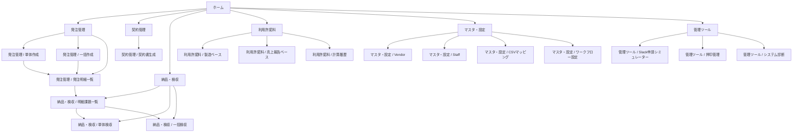

# Admin UI Redesign Wireframe

## 目的

現状の管理UIは、`機能単位` では整理されているが、実際の利用者は `業務単位` で作業したい。

特に次の迷いが起きやすい。

- `発注書単体作成` が `申請シミュレーター` に埋もれている
- `CSV取込` と `発注書作成` と `納品・検収` の境界が分かりづらい
- 「何をしたいか」ではなく「内部機能名」で画面を探す必要がある
- `1明細1課題` で運用したいのに、一覧の主導線が弱い

そのため、次の方針で UI を再設計する。

- 画面構造を `機能別` から `業務フロー別` へ変更する
- `発注管理` を独立した主導線にする
- `納品・検収` を `発注` から切り離して独立した主導線にする
- `申請シミュレーター` は管理ツールへ下げる
- `1明細1課題` の一覧画面を運用の中心に置く

## 新しい情報設計

### 第1階層

1. ホーム
2. 発注管理
3. 契約管理
4. 納品・検収
5. 利用許諾料
6. マスタ・設定
7. 管理ツール

### 第2階層

#### ホーム

- 今日やること
- 進行中案件
- 要対応アラート
- 最近生成した文書

#### 発注管理

- 単体作成
- 一括作成
- 発注明細一覧

#### 契約管理

- 契約書生成
- 起票済み案件検索

#### 納品・検収

- 明細課題一覧
- 単体検収
- 一括検収

#### 利用許諾料

- 製造ベース
- 売上報告ベース
- 計算履歴

#### マスタ・設定

- Vendor
- Staff
- CSVマッピング
- ワークフロー設定

#### 管理ツール

- Slack申請シミュレーター
- 押印管理
- システム診断

## 画面遷移図



## ホームのワイヤー

```text
+----------------------------------------------------------------------------------+
| ホーム                                                                           |
+----------------------------------------------------------------------------------+
| 今日やること                                                                     |
| [発注書を単体作成] [CSVから発注を一括作成] [検収書を一括作成] [利用許諾料を計算] |
|                                                                                  |
| 進行中案件                                                                       |
| - 発注待ち 12件                                                                  |
| - 納品待ち 8件                                                                   |
| - 検収待ち 5件                                                                   |
| - 支払待ち 4件                                                                   |
|                                                                                  |
| 要対応アラート                                                                   |
| - 納期超過                                                                       |
| - 検収日未登録                                                                   |
| - 支払予定日未登録                                                               |
| - Backlog同期注意                                                                |
|                                                                                  |
| 最近生成した文書                                                                 |
| - 発注書                                                                         |
| - 検収書                                                                         |
| - 利用許諾料計算書                                                               |
+----------------------------------------------------------------------------------+
```

### ホームで重視すること

- 機能の説明よりも `今日何をするか` を前に出す
- 入口は `単体作成 / 一括作成 / 検収 / 計算` の4本に絞る
- `要対応アラート` は運用優先で上に出す

## 発注管理のワイヤー

```text
+----------------------------------------------------------------------------------+
| 発注管理                                                                         |
+----------------------------------------------------------------------------------+
| Tabs: [単体作成] [一括作成] [発注明細一覧]                                       |
+----------------------------------------------------------------------------------+
| 単体作成                                                                         |
| 文書種別: ( ) 発注書  ( ) 企画発注書  ( ) 出版発注書                            |
|                                                                                  |
| ヘッダ情報                                                                       |
| - 案件名                                                                         |
| - 相手方                                                                         |
| - マスター契約参照                                                               |
| - 発注概要                                                                       |
|                                                                                  |
| 明細入力                                                                         |
| [手入力で1行追加] [CSV貼り付け] [Excel読込]                                      |
|                                                                                  |
| 明細プレビュー                                                                   |
| | No | 登録番号 | 件名 | 金額 | 納期 |                                           |
|                                                                                  |
| [プレビュー] [Backlog起票] [PDF生成]                                             |
+----------------------------------------------------------------------------------+
```

### 単体作成で重視すること

- `申請シミュレーター` という名前を出さない
- 最初から `発注書` が選ばれている
- 手入力と CSV を同じ文脈で扱う
- 実行ボタンは `Backlog起票` を中心に置く

## 発注一括作成のワイヤー

```text
+----------------------------------------------------------------------------------+
| 発注管理 / 一括作成                                                              |
+----------------------------------------------------------------------------------+
| 1. 取込種別                                                                      |
| [企画発注書] [出版発注書]                                                        |
|                                                                                  |
| 2. ファイル読込                                                                   |
| [CSVを選ぶ] [Excelを選ぶ]                                                         |
|                                                                                  |
| 3. プレビュー                                                                     |
| | No | 取引先 | 件名 | 金額 | 納期 | 検収日 | 支払予定日 |                     |
|                                                                                  |
| 4. 起票方式                                                                       |
| ( ) 親課題のみ                                                                    |
| ( ) 親課題 + 1明細1課題を自動作成                                                |
|                                                                                  |
| [起票する]                                                                       |
+----------------------------------------------------------------------------------+
```

### 一括作成で重視すること

- `起票方式` を明示して、`1明細1課題` をユーザーが理解しやすくする
- `納期 / 検収日 / 支払予定日` をプレビュー段階で見せる
- 起票後は自然に `発注明細一覧` へ遷移させる

## 発注明細一覧のワイヤー

```text
+----------------------------------------------------------------------------------+
| 発注管理 / 発注明細一覧                                                          |
+----------------------------------------------------------------------------------+
| 検索                                                                             |
| - 親課題キー                                                                     |
| - 取引先                                                                         |
| - 納期                                                                           |
| - 状態                                                                           |
|                                                                                  |
| 一覧                                                                             |
| | 明細No | 件名 | 納期 | 検収日 | 支払予定日 | 状態 | 操作 |                   |
| |   1    | ...  | ...  |   -    |     -      | 納品待ち | 開く |               |
|                                                                                  |
| アラート                                                                         |
| - 納期超過なのに納品待ち                                                         |
| - 納品済みなのに検収書未作成                                                     |
| - 検収日ありなのに未検収                                                         |
+----------------------------------------------------------------------------------+
```

### 発注明細一覧で重視すること

- `1明細1課題` 運用の中心画面にする
- 発注後の追跡とアラート確認をここに集約する
- `納品・検収` への導線をこの画面から張る

## 納品・検収のワイヤー

```text
+----------------------------------------------------------------------------------+
| 納品・検収                                                                       |
+----------------------------------------------------------------------------------+
| Tabs: [明細課題一覧] [単体検収] [一括検収]                                       |
+----------------------------------------------------------------------------------+
| 明細課題一覧                                                                     |
| | 明細No | 件名 | 納期 | 検収日 | 支払予定日 | 状態 | 操作 |                   |
|                                                                                  |
| 単体検収                                                                         |
| - 課題キー                                                                       |
| - 検収日                                                                         |
| - 検収備考                                                                       |
| [検収書生成] [Backlog更新]                                                       |
|                                                                                  |
| 一括検収                                                                         |
| - 親課題キー                                                                     |
| - 検収日入りCSV                                                                  |
| - 対象明細の選択                                                                 |
| [検収書を一括生成] [Backlogを処理済みに更新]                                     |
+----------------------------------------------------------------------------------+
```

### 納品・検収で重視すること

- `納品リクエスト作成` より `既存明細課題の更新` を中心に見せる
- `検収書を作る` と `Backlogを更新する` を同一フローで見せる
- `課題が無いから管理できない` 状態を避ける

## 利用許諾料のワイヤー

```text
+----------------------------------------------------------------------------------+
| 利用許諾料                                                                       |
+----------------------------------------------------------------------------------+
| Tabs: [製造ベース] [売上報告ベース] [計算履歴]                                   |
+----------------------------------------------------------------------------------+
| 製造ベース                                                                       |
| - ライセンス課題キー                                                             |
| - 製品名                                                                         |
| - 製造完了日                                                                     |
| - 数量                                                                           |
| - MSRP                                                                           |
| - 報告期限 / 支払期限                                                            |
| [計算プレビュー] [計算書生成] [支払通知書生成]                                   |
|                                                                                  |
| 売上報告ベース                                                                   |
| - ライセンス課題キー                                                             |
| - 報告対象期間                                                                   |
| - 売上高                                                                         |
| - 受領額                                                                         |
| - 報告期限 / 支払期限                                                            |
| [計算プレビュー] [計算書生成] [支払通知書生成]                                   |
+----------------------------------------------------------------------------------+
```

### 利用許諾料で重視すること

- `計算入口` と `帳票生成` を分けすぎない
- `Backlog の期限正本` を画面上でも見えるようにする

## マスタ・設定のワイヤー

```text
+----------------------------------------------------------------------------------+
| マスタ・設定                                                                     |
+----------------------------------------------------------------------------------+
| Tabs: [Vendor] [Staff] [CSVマッピング] [ワークフロー設定]                        |
+----------------------------------------------------------------------------------+
| Vendor                                                                           |
| - 個別登録                                                                       |
| - CSV一括登録                                                                    |
|                                                                                  |
| Staff                                                                            |
| - 担当者登録                                                                     |
|                                                                                  |
| CSVマッピング                                                                    |
| - 企画発注書                                                                     |
| - 出版発注書                                                                     |
|                                                                                  |
| ワークフロー設定                                                                  |
| - 承認者                                                                         |
| - 押印担当                                                                       |
+----------------------------------------------------------------------------------+
```

## 管理ツールのワイヤー

```text
+----------------------------------------------------------------------------------+
| 管理ツール                                                                       |
+----------------------------------------------------------------------------------+
| [Slack申請シミュレーター] [押印管理] [システム診断]                              |
+----------------------------------------------------------------------------------+
```

### 管理ツールで重視すること

- 本業務の主導線から切り離す
- 検証・保守系として位置づける

## 旧UIからの置き換え方針

### 現状

- `/admin`
- `/admin/orders/csv`
- `/admin/workflow/request-simulator`
- `/admin/workflow/delivery`
- `/admin/workflow/royalty`

### 変更後

- `/admin`
  - ホーム
- `/admin/orders`
  - 発注管理トップ
- `/admin/orders/create`
  - 単体作成
- `/admin/orders/bulk`
  - 一括作成
- `/admin/orders/items`
  - 発注明細一覧
- `/admin/delivery`
  - 納品・検収トップ
- `/admin/royalty`
  - 利用許諾料トップ
- `/admin/tools`
  - 管理ツールトップ

## 実装順のおすすめ

1. ナビゲーションを `業務フロー別` に組み替える
2. `発注管理` のトップページを追加する
3. `発注書単体作成` を `申請シミュレーター` から分離する
4. `発注明細一覧` を独立させて `1明細1課題` 管理の中心にする
5. `納品・検収` を `既存明細課題更新` 中心の画面へ寄せる
6. `申請シミュレーター` を `管理ツール` 配下へ移動する

## 判断基準

この再設計で良い状態は次。

- ユーザーが `何をしたいか` から画面を選べる
- `発注 -> 納品 -> 検収 -> 支払` の流れが UI 上で自然につながる
- `発注書単体作成` が迷わず見つかる
- `1明細1課題` の一覧とアラートが中心に置かれる
- `申請シミュレーター` が本番運用導線を邪魔しない
