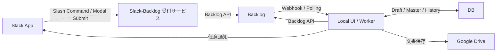
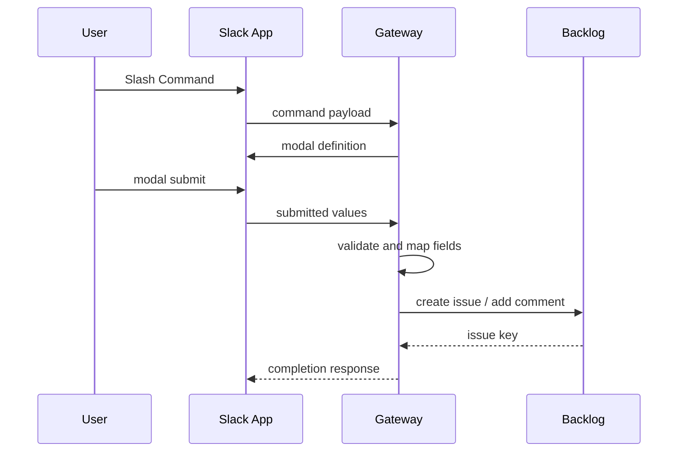
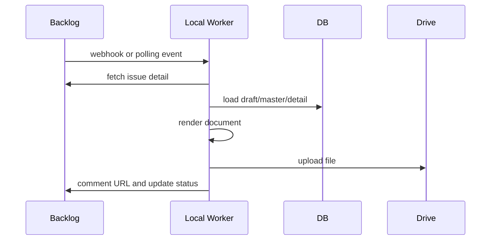
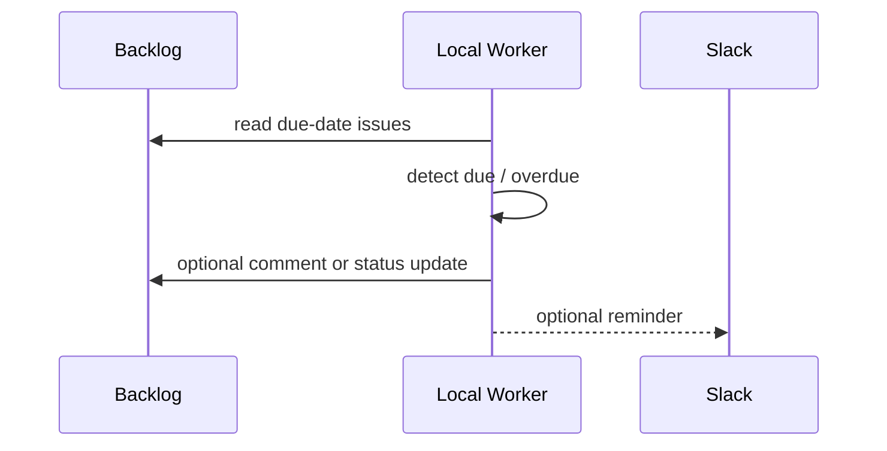

# Architecture V2

## 目的

Slack と Backlog の間に、保守運用の障壁になりやすい Local UI や業務 DB を介在させない。

目標は次の 2 点。

- `Slack <-> Backlog` は API 連携だけで成立する
- `Local / DB` は Backlog を読んで動く補助系として分離する

## 設計原則

- `Backlog` を案件の正本とする
- `Slack` は受付と通知のチャネルとする
- `Slack -> Backlog` の主線に `Local` と `DB` を必須で挟まない
- `Local` は `Backlog` を読んで文書生成、補完、再処理を行う
- `DB` は下書き、マスタ、履歴、計算結果などの補助情報を持つ
- `Backlog` 課題キーがあれば、Slack 未接続でも Local 側の処理を再実行できる
- Slack 通知やスレッド情報がなくても業務主線は継続できる
- 納品期日、利用許諾料計算の報告期限、支払期日は Backlog 課題の期限日または対応カスタム属性を正本とする

## 全体構成図

## 境界の考え方

### 1. Slack と Backlog の主線

`Slack -> Gateway -> Backlog`

- 受付モーダルの表示
- 入力バリデーション
- Backlog 課題起票
- Backlog コメント追記
- 必要最小限の検索

この層では `Local` や `DB` を必須にしない。

### 2. Backlog と Local の主線

`Backlog -> Local`

- 課題更新の検知
- 文書生成対象の判断
- UI の初期表示
- 期限管理対象の読込
- 再生成、再計算、再通知

Local は Backlog を読んで動く。Slack の内部状態を正本にしない。

### 3. Local と DB の役割

`Local <-> DB`

- 文書下書き
- 相手方マスタ
- 担当者マスタ
- 明細データ
- 計算結果
- 履歴
- 生成済み文書メタデータ

DB にしか存在しない値で `Slack -> Backlog` の受付主線が止まらないようにする。

## コンポーネント別責務

## 正本ルール

- 案件ヘッダ
  - 件名、相手方、依頼者、期限、課題種別は Backlog を正本とする
- 進行状態
  - ステータス、親子課題関係、期限日は Backlog を正本とする
- 補助データ
  - 文書下書き、生成済み文書メタデータ、通知履歴、マスタ補完値は DB を補助情報として扱う
- Drive 保存先
  - Backlog に専用属性を持たない間は既定値を用い、DB 保存値は補助扱いにとどめる

## Slack App

- Slash Command の入口
- Modal の表示
- ユーザー操作の受付
- 承認、押印、通知のチャネル

Slack App 自体は案件の正本を持たない。

## Slack-Backlog 受付サービス

- Slack の Slash Command / Interactivity を受ける
- モーダル定義を返す
- モーダル入力を Backlog カスタム属性へ変換する
- Backlog API を呼ぶ
- Backlog カスタム属性との整合性をチェックする

ここは `Local` と切り離された軽量サービスとして扱う。

実装上も `src/gateway/` を独立エントリーポイントとして持ち、`npm run start:gateway` で単独起動できるようにする。

## Backlog

- 案件ヘッダの保持
- ステータス管理
- 期限管理
- 親子課題・参照キー管理
- 検索起点
- Local 起動の基準データ

管理対象の例:

- 契約種別
- 相手方
- 希望期限
- 納品期限
- 計算期限
- 支払期限
- 親課題キー
- ライセンス参照キー

## Local UI / Worker

- Backlog 課題の読込
- Backlog と DB の値を統合した初期表示
- 文書生成
- 再生成
- 期限監視
- Backlog ステータス更新
- 任意の Slack 通知

Local が停止しても Backlog 側の案件管理は成立する。

## DB

- 下書き
- マスタ
- 明細
- 計算結果
- 処理履歴
- 生成済み文書 URL

DB は補助系の正本であり、案件起票の主線の正本ではない。

## データ正本のルール

| 項目 | 正本 |
|------|------|
| 案件ID / 課題キー | Backlog |
| 案件ステータス | Backlog |
| 納品期限 / 計算期限 / 支払期限 | Backlog |
| 文書下書き | DB |
| 相手方詳細マスタ | DB |
| 明細行 | DB |
| 計算結果 | DB |
| Slack スレッド情報 | 任意補助情報 |

## 主要フロー

### A. 受付フロー

### B. 文書生成フロー

### C. 期限管理フロー

## Backlog で管理する期限

Backlog では次の期限管理が可能。

- 納品期日
- 検収期限
- 利用許諾計算期限
- 報告期限
- 支払期限

推奨運用:

- 契約や案件は親課題
- 納品、検収、月次計算、支払処理は子課題
- 各課題に `期限日 + 種別 + ステータス` を持たせる

## モーダルと Backlog 属性の整合性方針

Modal 制御は Slack App の後段にある `Slack-Backlog 受付サービス` で行う。

推奨方針:

- モーダル定義と Backlog カスタム属性マッピングを同じコードベースで管理する
- 起動時に Backlog 課題タイプとカスタム属性との差分チェックを行う
- 差分があれば起票を止めるか警告する

この方式なら、従来 Local にあった整合制御を Slack-Backlog 専用サービスへ移せる。

## 運用上の利点

- Slack と Backlog の保守境界が明確になる
- Local / DB の障害が受付主線を止めにくい
- 開発中の UI・DB 変更が Slack 受付に波及しにくい
- 障害切り分けがしやすい
- Backlog 課題キー単位で再処理しやすい

## 運用設計

新アーキテクチャの運用手順、障害切り分け、移行手順は `docs/operations/ARCHITECTURE_V2_OPERATIONS.md` を参照する。

## 今後の実装方針

1. `Slash Command -> Modal -> Backlog起票` を軽量受付サービスに集約する
   - 初期実装では `/法務依頼` の新規起票と既存課題追記を `src/slack/gatewayHandlers.ts` に分離する
2. Local UI は `Backlog課題キー指定` で開ける前提にする
3. DB 依存の値を受付主線から外す
4. 納品・利用許諾計算の期限は Backlog 課題で管理する
5. Slack 通知は任意処理として扱う
