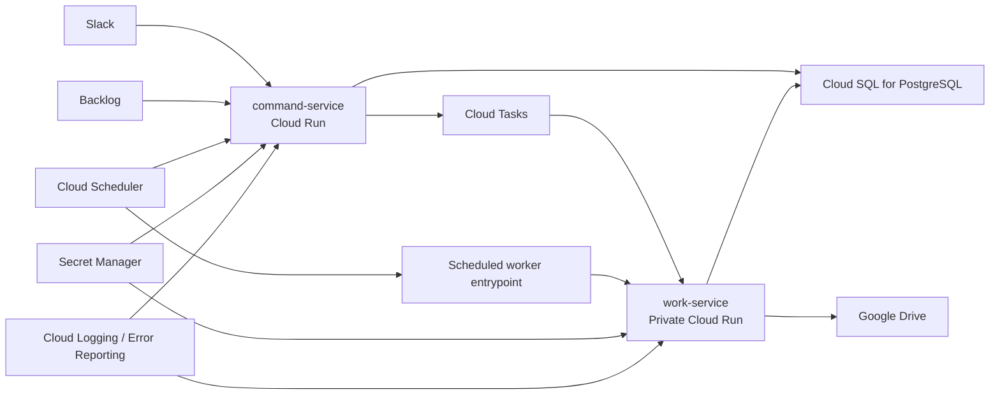

# GCP Target Architecture

## Goal

LegalBridge を GCP 上で安定運用できるように、現行のローカル一体型構成を次の 3 層へ再設計する。

- `command-service`
  - Slack / Backlog からの受付と指令判断を担当する公開 API
- `work-service`
  - 文書生成、PDF 化、Drive 保存、集計、重いワークフロー処理を担当する内部実行系
- `shared`
  - Backlog / DB / workflow / notification の共通ロジック

この再設計の目的は、Slack や Backlog の受付応答を速く保ちつつ、重い処理や再実行が必要な処理を GCP の非同期基盤へ分離することにある。

## Current State

現行コードは責務としては分離可能だが、実装上はまだ密結合である。

- 受付系
  - `src/gateway/app.ts`
  - `src/slack/handlers.ts`
  - `src/webhook/backlog.ts`
- 作業系
  - `src/documents/*`
  - `src/orders/*`
  - `src/payments/*`
  - `src/documents/royaltyGenerator.ts`
  - `src/documents/partialDeliveryGenerator.ts`
- 常駐系
  - `src/index.ts`
  - `src/db/scheduler.ts`
  - `src/backlog/poller.ts`

特に `src/webhook/backlog.ts` と `src/workflow/router.ts` は、Backlog のイベント受付から文書生成や通知実行までを直接呼んでいるため、Cloud Run 上でのスケールや再試行設計と相性が悪い。

## Target Architecture

## GCP Service Mapping

- `Cloud Run`
  - `command-service` の公開 API をホストする
- `Cloud Tasks`
  - 受付後すぐ返したい非同期処理をキュー化する
- `Private Cloud Run`
  - `work-service` を内部呼び出し専用で配置する
- `Cloud Scheduler`
  - 定期通知、Backlog polling、保守バッチの起動元にする
- `Cloud SQL for PostgreSQL`
  - Prisma の永続層を維持したまま移行する
- `Secret Manager`
  - Slack / Backlog / DB / Google 認証情報を一元管理する
- `Artifact Registry`
  - 各サービスのコンテナイメージ管理
- `Cloud Logging / Error Reporting`
  - 実行履歴と障害監視

## Service Responsibilities

### command-service

責務:

- Slack slash command の受付
- Slack interaction の受付
- Backlog webhook の受付
- Backlog 状態を見て「何の作業を起こすか」を判定
- 作業の直接実行ではなく task を発行
- 軽量な status / health API 提供

主な移管対象:

- `src/gateway/*`
- `src/slack/*`
- `src/webhook/backlog.ts` の受信とルーティング部分
- `src/workflow/router.ts` の判定部分
- `src/backlog/client.ts`

非責務:

- PDF 生成
- Drive 保存
- ロイヤリティ計算本体
- 長時間のテンプレート描画
- `setInterval` 常駐処理

### work-service

責務:

- 文書生成
- WeasyPrint による PDF 化
- Google Drive 保存
- Backlog コメント追記
- Slack thread への結果返却
- ロイヤリティ計算
- 納品/検収関連ドキュメント生成
- task の再試行に耐える冪等な実行

主な移管対象:

- `src/documents/*`
- `src/orders/*`
- `src/payments/*`
- `src/documents/royaltyGenerator.ts`
- `src/documents/partialDeliveryGenerator.ts`
- `src/documents/templateRenderer.ts`
- `src/documents/fileStorage.ts`

### shared

責務:

- Prisma / repository 層
- Backlog issue 文脈解決
- workflow ステータス定義
- Slack thread 投稿ユーティリティ
- 共通 DTO / event payload 定義

主な移管対象:

- `src/db/*`
- `src/workflow/statusConfig.ts`
- `src/workflow/documentDefaults.ts`
- `src/backlog/issueContext.ts`
- `src/slack/threading.ts`

## Recommended Async Boundaries

`command-service` から `work-service` へ直接重い処理を呼ばず、Cloud Tasks 経由で次の単位に分解する。

- `generate-contract-documents`
  - NDA / 外注 / ライセンス / 売買契約などの文書生成
- `generate-order-documents`
  - 発注書、企画発注書、出版発注書の生成
- `generate-royalty-report`
  - ロイヤリティ計算書、支払通知書の生成
- `process-delivery-event`
  - 納品・検収イベント処理
- `sync-backlog-transition`
  - Backlog 状態変化に応じたフォローアップ処理

Cloud Tasks を優先する理由:

- 1 リクエストに対して 1 処理の対応が多い
- 再試行と遅延実行が扱いやすい
- task payload を明示しやすい

## Scheduled Processing

現行の `setInterval` 実装は Cloud Run 常駐前提なので、Cloud Scheduler 起動へ置き換える。

- `src/db/scheduler.ts`
  - 毎日実行する通知・ステータス更新
- `src/backlog/poller.ts`
  - 30 秒間隔 polling から、用途を見直して scheduler 起動か webhook 優先へ寄せる

推奨方針:

- webhook で足りる処理は polling を廃止
- どうしても polling が必要なものだけ Scheduler + internal endpoint にする

## Data and Secrets

### Database

- 現行の Prisma を維持し、Cloud SQL for PostgreSQL へ移行する
- `DATABASE_URL` は Cloud SQL 接続前提に統一する
- マイグレーションは CI/CD か限定的な運用手順で実施する

### Secrets

Secret Manager に集約する対象:

- `SLACK_BOT_TOKEN`
- `SLACK_SIGNING_SECRET`
- `SLACK_APP_TOKEN`
- `BACKLOG_API_KEY`
- `DATABASE_URL`
- Google service account 認証情報

補足:

- 現行は `GOOGLE_SERVICE_ACCOUNT_KEY_PATH` によるファイル読み込み前提の箇所があるため、Secret Manager からの注入か Workload Identity へ移行する

## Runtime Model

### command-service runtime

- リクエストは短時間で応答する
- webhook 受信時は task 発行までで返す
- Slack interaction は `ack` を優先し、その後に非同期処理へ渡す

### work-service runtime

- task payload を受けて処理する
- 実行中に DB へ進捗や結果を保存する
- 成功時は Backlog コメントと Slack thread を更新する
- 再試行時の二重生成を防ぐため、issue key と action type 単位の冪等性キーを持つ

## Refactoring Plan

### Phase 1: Boundary Extraction

- `src/webhook/backlog.ts` から重い実処理を分離する
- task payload 型を `shared` に導入する
- 直接呼び出しを `enqueueWork(...)` に置き換える

成果物:

- 受付系と作業系の責務分離
- 既存コードを壊さずに非同期境界を導入

### Phase 2: Service Split

- `command-service` の entrypoint を独立させる
- `work-service` の entrypoint を独立させる
- 共通ロジックを `shared` へ移す

成果物:

- 別デプロイ可能な 2 サービス構成

### Phase 3: Scheduler Migration

- `src/db/scheduler.ts` を scheduler endpoint 化
- `src/backlog/poller.ts` を必要最小限へ縮小
- Cloud Scheduler から実行する

### Phase 4: Secret and Identity Migration

- キーファイル依存を減らす
- Secret Manager 注入へ統一する
- 必要に応じて Drive アクセス方法を見直す

### Phase 5: Hardening

- 冪等性キー
- DLQ または失敗時の再処理手順
- 監視、アラート、実行追跡

## File-Level Target Ownership

### command-service に寄せる

- `src/gateway/app.ts`
- `src/gateway/index.ts`
- `src/gateway/status.ts`
- `src/slack/handlers.ts`
- `src/slack/gatewayHandlers.ts`
- `src/slack/modalBuilders.ts`
- `src/webhook/backlog.ts`
- `src/workflow/router.ts`

### work-service に寄せる

- `src/documents/generator.ts`
- `src/documents/fileStorage.ts`
- `src/documents/royaltyGenerator.ts`
- `src/documents/partialDeliveryGenerator.ts`
- `src/documents/templateRenderer.ts`
- `src/orders/generator.ts`
- `src/payments/*`

### shared に寄せる

- `src/db/client.ts`
- `src/db/repository.ts`
- `src/db/orderRepository.ts`
- `src/backlog/client.ts`
- `src/backlog/issueContext.ts`
- `src/workflow/documentDefaults.ts`
- `src/workflow/statusConfig.ts`
- `src/slack/threading.ts`

## Risks

- WeasyPrint の Cloud Run 実行依存
- Google Drive 認証のファイル前提実装
- webhook 再送による二重生成
- Backlog polling の縮退設計不足
- ローカル一体起動 `src/index.ts` への依存が残ること

## Immediate Next Steps

1. task payload と queue adapter のインターフェースを追加する
2. `src/webhook/backlog.ts` の重い処理を task 発行へ置き換える
3. `work-service` の最小 entrypoint を追加する
4. scheduler 系処理を HTTP 起動に寄せる
5. その後にデプロイ設定を分離する

この文書は、以降のコード変更で「どの責務をどこへ移すか」の基準として扱う。
